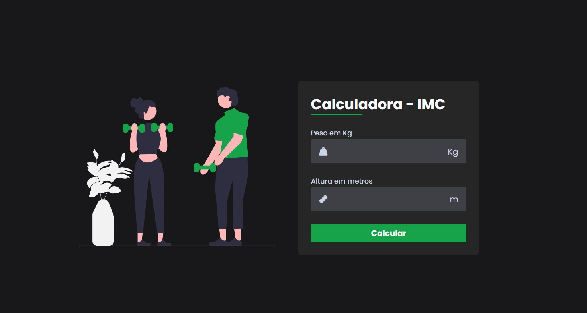

# 🧮 Calculadora de IMC

Uma calculadora simples de **Índice de Massa Corporal (IMC)** feita com **HTML, CSS e JavaScript**.  
O objetivo do projeto é praticar conceitos básicos de desenvolvimento web e disponibilizar uma ferramenta útil para calcular o IMC.

---

## 📚 Tecnologias utilizadas
- HTML5
- CSS3
- JavaScript

---

## 🚀 Funcionalidades
- Entrada de **peso (kg)** e **altura (m)**.
- Cálculo automático do IMC.
- Interface moderna e responsiva.
- Exibição do resultado de forma clara.

---

## 🖼️ Demonstração
 

---

## 🧑‍💻 Como usar
1. Clone o repositório:
   ```bash
   git clone https://github.com/murillooliveiras/calculadora_imc.git
